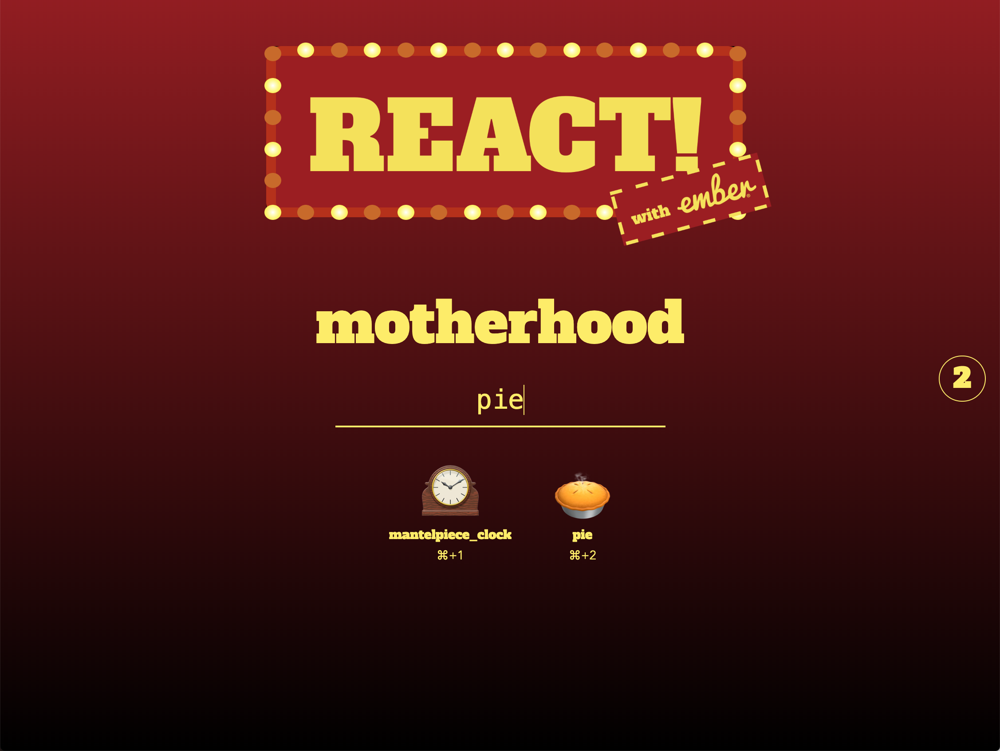
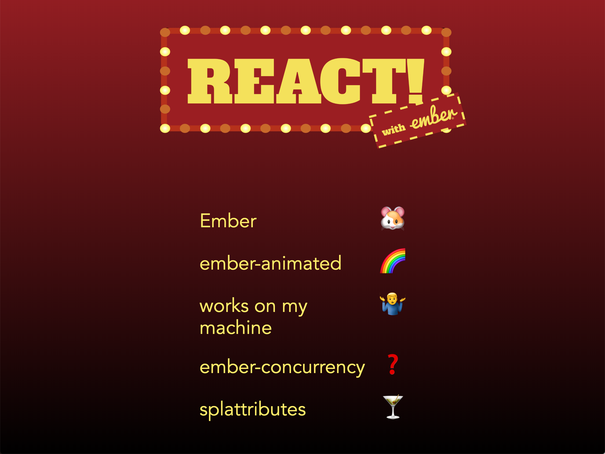
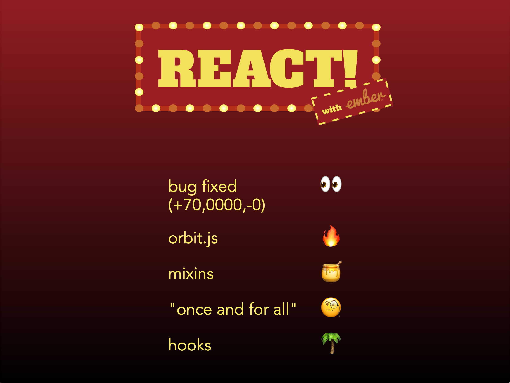
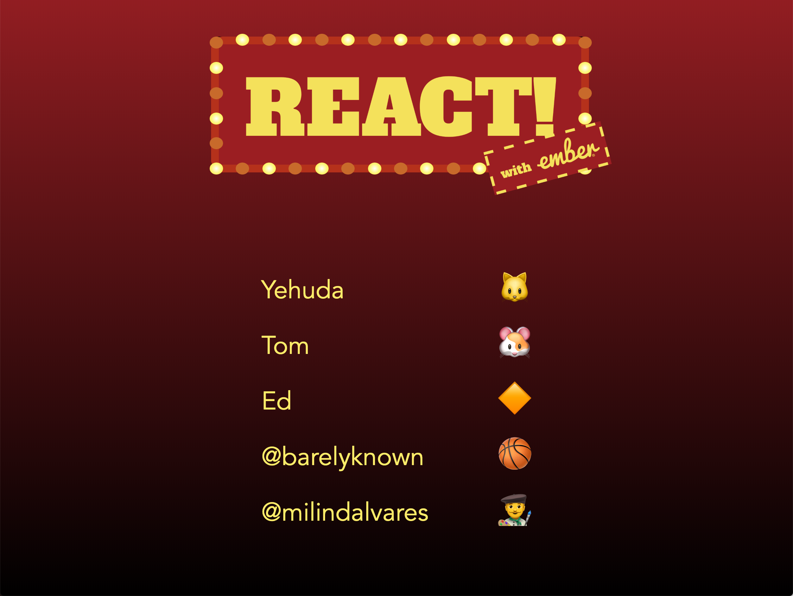

# react-with-ember

Emoji-reaction practice application, written in Ember Octane by [@milindalvares](https://twitter.com/milindalvares) and [@barelyknown](https://twitter.com/barelyknown) for a lightning talk at EmberFest 2019 in Copenhagen, Denmark.










## Install Yourself

```
npm install
ember s
```

## Disclaimer

Seriously, we didn't start writing the code until 10PM the night before the lightning talks after we got back from pizza. _There are hacksssss._